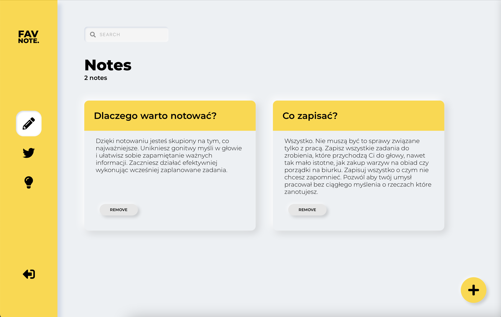

# FavNote

Twoje wszystkie notatki teraz już w zasięgu ręki\
są dostępne pod adresem: [https://hopeful-neumann-feb8ae.netlify.app](https://hopeful-neumann-feb8ae.netlify.app).

### Dlaczego warto notować?

Dzięki notowaniu jesteś skupiony na tym, co najważniejsze. Unikniesz gonitwy myśli w głowie i ułatwisz sobie zapamiętanie ważnych informacji. Zaczniesz działać efektywniej wykonując wcześniej zaplanowane zadania.

### Co zapisać?

Wszystko. Nie muszą być to sprawy związane tylko z pracą. Zapisz wszystkie zadania do zrobienia, które przychodzą Ci do głowy, nawet tak mało istotne, jak zakup warzyw na obiad czy porządki na biurku. Zapisuj wszystko o czym nie chcesz zapomnieć. Pozwól aby twój umysł pracował bez ciągłego myślenia o rzeczach które zanotujesz.

## Użyte technologie

<ul>
    <li>JavaScript - React</li>
    <li>CSS - Styled components</li>
    <li>Reduxjs/toolkit</li>
    <li>Redux thunk</li>
    <li>Formik</li>
    <li>Firebase</li>
    <li>Fort awesome</li>
</ul>

## Podgląd aplikacji

Inspiracja zaczerpnięta z kursu na eduweb.
